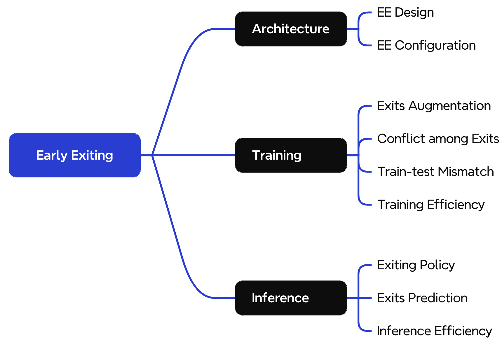

# Awesome-Early-Exiting-Neural-Network

A paper list for early-exiting neural networks (ENN).

The idea of early exiting is firsly proposed in *ICPR16-BranchyNet: Fast Inference via Early Exiting from Deep Neural Networks*.

ENN inserts **intermediate classifiers** at various network depths, allows the **early termination** of inference for simple inputs with high-confidence predictions and encourages **efficient inference**.

ENN is also named multi-exit NN in some papers.

We categorized ENN into four types and collected corresponding papers.

+ **Architecture**
+ **Training**
+ **Tuning**
+ **Inference**

A detailed mindmap of paper collected is illustrated as follow

**More items will be added to the repository**. Please feel free to suggest other key resources by opening an issue report, submitting a pull request, or dropping me an email @ ([boyliu@buaa.edu.cn](mailto:boyliu@buaa.edu.cn)). 🥳

<!-- main-start -->

## 0. Survey
### Survey
| Title | Abbreviation | Venue | Year | Materials |
|----------|----|----|----|----|
| Dynamic Neural Network Structure: A Review for Its Theories and Applications | N/A | TNNLS | 2024 | [[PAGE](https://ieeexplore.ieee.org/abstract/document/10492471)] |
| Dynamic neural networks: A survey | N/A | TPAMI | 2022 | [[PAGE](https://ieeexplore.ieee.org/abstract/document/9560049)] [[PDF](https://arxiv.org/pdf/2102.04906)] |
| Split computing and early exiting for deep learning applications: Survey and research challenges | N/A | CSUR | 2022 | [[PAGE](https://dl.acm.org/doi/full/10.1145/3527155)] [[PDF](https://dl.acm.org/doi/pdf/10.1145/3527155)] |
| Adaptive inference through early-exit networks: Design, challenges and directions | N/A | EMDL@MobiSys | 2021 | [[PAGE](https://dl.acm.org/doi/abs/10.1145/3469116.3470012)] [[PDF](https://arxiv.org/pdf/2106.05022)] |

## 1. Architecture
### EEN Design
| Title | Abbreviation | Venue | Year | Materials |
|----------|----|----|----|----|
| Unlocking the Non-deterministic Computing Power with Memory-Elastic Multi-Exit Neural Networks | MEEdge | WWW | 2024 | [[PAGE](https://dl.acm.org/doi/abs/10.1145/3589334.3645340)] |
| Multi-Scale Dense Networks for Resource Efficient Image Classification | MSDNet | ICLR | 2018 | [[PDF](https://arxiv.org/pdf/1703.09844)] |

### EEN Configuration
| Title | Abbreviation | Venue | Year | Materials |
|----------|----|----|----|----|
| SLEXNet: Adaptive Inference Using Slimmable Early Exit Neural Networks | SLEXNet | TECS | 2024 | [[PAGE](https://dl.acm.org/doi/full/10.1145/3689632)] [[PDF](https://dl.acm.org/doi/pdf/10.1145/3689632)] |
| HADAS: Hardware-Aware Dynamic Neural Architecture Search for Edge Performance Scaling | HADAS | DATE | 2023 | [[PAGE](https://ieeexplore.ieee.org/abstract/document/10137095)] |
| Multi-Exit Semantic Segmentation Networks | MESS | ECCV | 2022 | [[PAGE](https://link.springer.com/chapter/10.1007/978-3-031-19803-8_20)] |
| Enabling Low Latency Edge Intelligence based on Multi-exit DNNs in the Wild | ME-DNN | ICDCS | 2021 | [[PAGE](https://ieeexplore.ieee.org/abstract/document/9546491)] |
| HAPI: Hardware-Aware Progressive Inference | HAPI | ICCAD | 2020 | [[PAGE](https://dl.acm.org/doi/abs/10.1145/3400302.3415698)] |
| FlexDNN: Input-Adaptive On-Device Deep Learning for Efficient Mobile Vision | FlexDNN | SEC | 2020 | [[PAGE](https://ieeexplore.ieee.org/abstract/document/9355785)] |

## 2. Training
### KD for Training
| Title | Abbreviation | Venue | Year | Materials |
|----------|----|----|----|----|
| Unlocking the Non-deterministic Computing Power with Memory-Elastic Multi-Exit Neural Networks | MEEdge | WWW | 2024 | [[PAGE](https://dl.acm.org/doi/abs/10.1145/3589334.3645340)] |
| Harmornized Dense Knowledge Distiilation Training for Multi-Exit Architecture | HDKD | AAAI | 2021 | [[PAGE](https://ojs.aaai.org/index.php/AAAI/article/view/17225)] [[PDF](https://ojs.aaai.org/index.php/AAAI/article/view/17225/17032)] |
| Distillation-Based Training for Multi-Exit Architectures | N/A | ICCV | 2019 | [[PAGE](https://openaccess.thecvf.com/content_ICCV_2019/html/Phuong_Distillation-Based_Training_for_Multi-Exit_Architectures_ICCV_2019_paper.html)] [[PDF](https://openaccess.thecvf.com/content_ICCV_2019/papers/Phuong_Distillation-Based_Training_for_Multi-Exit_Architectures_ICCV_2019_paper.pdf)] |

### Conflict among Exits
| Title | Abbreviation | Venue | Year | Materials |
|----------|----|----|----|----|
| Deep Feature Surgery: Towards Accurate and Efficient Multi-Exit Networks | DFS | ECCV | 2024 | [[PDF](https://arxiv.org/pdf/2407.13986)] |
| Meta-GF: Training Dynamic-Depth Neural Networks Harmoniously | Meta-GF | ECCV | 2022 | [[PAGE](https://link.springer.com/chapter/10.1007/978-3-031-20083-0_41)] [[PDF](https://www.ecva.net/papers/eccv_2022/papers_ECCV/papers/136710691.pdf)] [[CODE](https://github.com/SYVAE/MetaGF)] |

### Train-test Mismatch
| Title | Abbreviation | Venue | Year | Materials |
|----------|----|----|----|----|
| Jointly-learned Exit and Inference for a Dynamic Neural Network: JEI-DNN | JEI-DNN | ICLR | 2024 | [[PAGE](https://openreview.net/forum?id=jX2DT7qDam)] [[PDF](https://openreview.net/pdf?id=jX2DT7qDam)] [[CODE](https://github.com/networkslab/dynn)] |
| Boosted Dynamic Neural Networks | BoostNet | AAAI | 2023 | [[PAGE](https://ojs.aaai.org/index.php/AAAI/article/view/26302)] [[PDF](https://ojs.aaai.org/index.php/AAAI/article/view/26302/26074)] [[CODE](https://github.com/SHI-Labs/Boosted-Dynamic-Networks)] |
| Learning to Weight Samples for Dynamic Early-exiting Networks | L2W-DEN | ECCV | 2022 | [[PAGE](https://dl.acm.org/doi/abs/10.1007/978-3-031-20083-0_22)] [[PDF](https://www.ecva.net/papers/eccv_2022/papers_ECCV/papers/136710363.pdf)] |

### Training Efficiency
| Title | Abbreviation | Venue | Year | Materials |
|----------|----|----|----|----|
| Hierarchical Training of Deep Neural Networks Using Early Exiting | N/A | TNNLS | 2024 | [[PAGE](https://ieeexplore.ieee.org/abstract/document/10530344)] |
| EE-LLM: Large-Scale Training and Inference of Early-Exit Large Language Models with 3D Parallelism | EE-LLM | ICML | 2024 | [[PAGE](https://openreview.net/forum?id=xFk0w9zoV3)] [[PDF](https://openreview.net/pdf?id=xFk0w9zoV3)] [[CODE](https://github.com/pan-x-c/EE-LLM)] |

## 3. Tuning
### KD for Tuning
| Title | Abbreviation | Venue | Year | Materials |
|----------|----|----|----|----|
| GAML-BERT: Improving BERT Early Exiting by Gradient Aligned Mutual Learning | GAML-BERT | EMNLP | 2021 | [[PAGE](https://aclanthology.org/2021.emnlp-main.242/)] [[PDF](https://aclanthology.org/2021.emnlp-main.242.pdf)] |
| DeeBERT: Dynamic Early Exiting for Accelerating BERT Inference | DeeBERT | ACL | 2020 | [[PAGE](https://aclanthology.org/2020.acl-main.204/)] [[PDF](https://aclanthology.org/2020.acl-main.204.pdf)] |
| FastBERT: a Self-distilling BERT with Adaptive Inference Time | FastBERT | ACL | 2020 | [[PAGE](https://aclanthology.org/2020.acl-main.537/)] |

### Test-time Adaptation
| Title | Abbreviation | Venue | Year | Materials |
|----------|----|----|----|----|
| Test-time Specialization of Dynamic Neural Networks | N/A | CVPR Workshop | 2024 | [[PAGE](https://openaccess.thecvf.com/content/CVPR2024W/MAT/html/Leroux_Test-time_Specialization_of_Dynamic_Neural_Networks_CVPRW_2024_paper.html)] [[PDF](https://openaccess.thecvf.com/content/CVPR2024W/MAT/papers/Leroux_Test-time_Specialization_of_Dynamic_Neural_Networks_CVPRW_2024_paper.pdf)] |

### Tuning Efficiency
| Title | Abbreviation | Venue | Year | Materials |
|----------|----|----|----|----|
| EE-Tuning: An Economical yet Scalable Solution for Tuning Early-Exit Large Language Models | N/A | arXiv | 2024 | [[PDF](https://arxiv.org/pdf/2402.00518)] |

## 4. Inference
### Exit Policy
| Title | Abbreviation | Venue | Year | Materials |
|----------|----|----|----|----|
| Elastic DNN Inference with Unpredictable Exit in Edge Computing | EINet | TMC | 2024 | [[PAGE](https://ieeexplore.ieee.org/abstract/document/10633848)] |
| Scheduling Inputs in Early Exit Neural Networks | N/A | TC | 2023 | [[PAGE](https://ieeexplore.ieee.org/abstract/document/10324303)] |
| FrameExit: Conditional Early Exiting for Efficient Video Recognition | FrameExit | CVPR | 2021 | [[PAGE](https://openaccess.thecvf.com/content/CVPR2021/html/Ghodrati_FrameExit_Conditional_Early_Exiting_for_Efficient_Video_Recognition_CVPR_2021_paper.html)] [[PDF](https://openaccess.thecvf.com/content/CVPR2021/papers/Ghodrati_FrameExit_Conditional_Early_Exiting_for_Efficient_Video_Recognition_CVPR_2021_paper.pdf)] |
| Empowering Adaptive Early-Exit Inference with Latency Awareness | N/A | AAAI | 2021 | [[PAGE](https://ojs.aaai.org/index.php/AAAI/article/view/17181)] |
| EPNet: Learning to Exit with Flexible Multi-Branch Network | EPNet | CIKM | 2020 | [[PAGE](https://dl.acm.org/doi/abs/10.1145/3340531.3411973)] |
| Shallow-Deep Networks: Understanding and Mitigating Network Overthinking | SDN | ICML | 2019 | [[PAGE](https://proceedings.mlr.press/v97/kaya19a.html)] [[PDF](https://proceedings.mlr.press/v97/kaya19a/kaya19a.pdf)] |
| Adaptive Neural Networks for Efficient Inference | N/A | ICML | 2017 | [[PAGE](https://proceedings.mlr.press/v70/bolukbasi17a.html)] [[PDF](https://proceedings.mlr.press/v70/bolukbasi17a/bolukbasi17a.pdf)] |

### Exits Prediction
| Title | Abbreviation | Venue | Year | Materials |
|----------|----|----|----|----|
| Predictive Exit: Prediction of Fine-Grained Early Exits for Computation- and Energy-Efficient Inference | N/A | AAAI | 2023 | [[PAGE](https://ojs.aaai.org/index.php/AAAI/article/view/26042)] |
| FIANCEE: Faster Inference of Adversarial Networks via Conditional Early Exits | FIANCEE | CVPR | 2023 | [[PAGE](https://openaccess.thecvf.com/content/CVPR2023/html/Karpikova_FIANCEE_Faster_Inference_of_Adversarial_Networks_via_Conditional_Early_Exits_CVPR_2023_paper.html)] [[PDF](https://openaccess.thecvf.com/content/CVPR2023/papers/Karpikova_FIANCEE_Faster_Inference_of_Adversarial_Networks_via_Conditional_Early_Exits_CVPR_2023_paper.pdf)] |

### Inference Ensemble
| Title | Abbreviation | Venue | Year | Materials |
|----------|----|----|----|----|
| Boosted Dynamic Neural Networks | BoostNet | AAAI | 2023 | [[PAGE](https://ojs.aaai.org/index.php/AAAI/article/view/26302)] [[PDF](https://ojs.aaai.org/index.php/AAAI/article/view/26302/26074)] [[CODE](https://github.com/SHI-Labs/Boosted-Dynamic-Networks)] |
| Towards Anytime Classification in Early-Exit Architectures by Enforcing Conditional Monotonicity | N/A | NIPS | 2023 | [[PAGE](https://proceedings.neurips.cc/paper_files/paper/2023/hash/af2d9fb5bcee19ef2dfa70d843520c97-Abstract-Conference.html)] [[PDF](https://proceedings.neurips.cc/paper_files/paper/2023/file/af2d9fb5bcee19ef2dfa70d843520c97-Paper-Conference.pdf)] |

### Inference Efficiency
| Title | Abbreviation | Venue | Year | Materials |
|----------|----|----|----|----|
| Temporal Decisions: Leveraging Temporal Correlation for Efficient Decisions in Early Exit Neural Networks | N/A |  | 2024 | [[PAGE](https://arxiv.org/abs/2403.07958)] [[PDF](https://arxiv.org/pdf/2403.07958)] |
| Unlocking the Non-deterministic Computing Power with Memory-Elastic Multi-Exit Neural Networks | MEEdge | WWW | 2024 | [[PAGE](https://dl.acm.org/doi/abs/10.1145/3589334.3645340)] |
| EE-LLM: Large-Scale Training and Inference of Early-Exit Large Language Models with 3D Parallelism | EE-LLM | ICML | 2024 | [[PAGE](https://openreview.net/forum?id=xFk0w9zoV3)] [[PDF](https://openreview.net/pdf?id=xFk0w9zoV3)] [[CODE](https://github.com/pan-x-c/EE-LLM)] |
| ClassyNet: Class-Aware Early-Exit Neural Networks for Edge Devices | ClassyNet | IOTJ | 2023 | [[PAGE](https://ieeexplore.ieee.org/abstract/document/10365527)] |

38 papers are included

<!-- main-end -->

 <!-- update-time-start -->

**Last Update: Oct 11, 2024 19:38:22**

<!-- update-time-end -->

